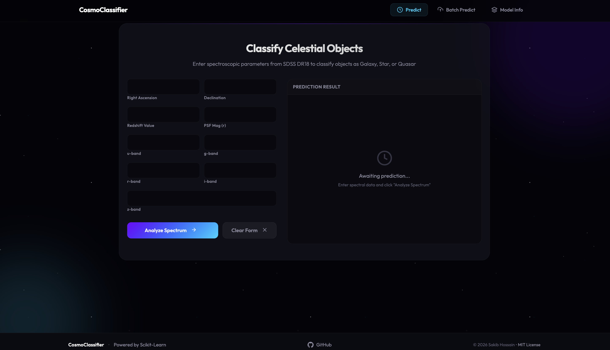
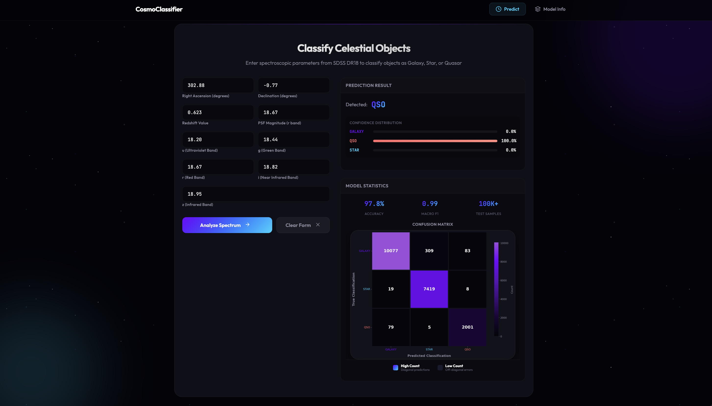

# 🌌 The CosmoClassifier  

A machine learning–powered web application that classifies celestial objects (Galaxies, Stars, and Quasars) using data from the **Sloan Digital Sky Survey DR18 (SDSS DR18)**.  
Built with **Flask**, **Scikit-Learn**, and **Pandas**, this project blends astronomy with machine learning to create an interactive and educational tool for space data analysis.  
This project demonstrates the intersection of astrophysics and applied machine learning which has made space data exploration more accessible.
___

## 🚀 Overview  

The **CosmoClassifier** uses a trained **Logistic Regression** model optimized through **RandomizedSearchCV** to predict whether a given object in the universe is a **Galaxy**, **Star**, or **Quasar (QSO)**.  
The model is hosted via a **Flask** web app where users can input photometric parameters (like magnitudes and redshift) and get instant predictions with probability scores.  

---

## 🧠 Motivation  

The Sloan Digital Sky Survey (SDSS) is one of the largest astronomical databases ever created. But handling its raw data isn’t exactly beginner-friendly.  
This project simplifies that complexity—transforming high-dimensional SDSS data into an approachable, real-time classification tool.  

---

## 📸 Screenshots



---

## 📊 Dataset  

- **Source:** [Sloan Digital Sky Survey DR18 – Kaggle Dataset](https://www.kaggle.com/datasets/diraf0/sloan-digital-sky-survey-dr18)  
- **Classes:**  
  - `GALAXY → 0`  
  - `STAR → 1`  
  - `QSO → 2`  
- **Feature Engineering:**  
  - Created new color-contrast features:  
    - `u_g_color = u − g`  
    - `g_r_color = g − r`  
    - `r_i_color = r − i`  
    - `i_z_color = i − z`  

---

## ⚙️ Model Architecture  

| Step | Description |
| :--- | :--- |
| **Imputation** | Missing values handled using median strategy |
| **Scaling** | Standardized with `StandardScaler` |
| **Oversampling** | Class imbalance handled using `SMOTE` |
| **Dimensionality Reduction** | Passthrough (No reduction applied) |
| **Classifier** | Logistic Regression (penalty = 'l1', solver = 'saga', C = 10) |

Final model artifacts are serialized with `joblib` as:
```
models/
├── estimator.pkl
└── column_names.pkl
```
---

## 🧪 Model Selection Research  

Previously, multiple combinations of models and dimensionality-reduction methods were tested before finalizing the architecture. This was a manual process which is now replaced by scikit-learn's RandomizedSearchCV algorithm, which allows us to find the best classifier and hyperparameter setting.

 Here is the **Classification Report** which was calculated after fitting the best model discovered by RandomizedSearchCV:
 | Class            | Precision | Recall | F1-Score | Support |
|-----------------|-----------|--------|----------|---------|
| 0 (GALAXY)              | 0.99      | 0.96   | 0.98     | 10469   |
| 1 (STAR)              | 0.96      | 1.00   | 0.98     | 7446    |
| 2 (QSO)              | 0.96      | 0.96   | 0.96     | 2085    |
| **Accuracy**    | -         | -      | 0.97     | 20000   |
| **Macro Avg**   | 0.97      | 0.97   | 0.97     | 20000   |
| **Weighted Avg**| 0.98      | 0.97   | 0.97     | 20000   |

You can find the code for this in [research_2.py](https://github.com/ByteBard58/The_CosmoClassifier/blob/main/research_2.py) file included in the repo. Note that this result is for the reduced feature dataset.

---

## 🧩 Project Structure
```
CosmoClassifier/
├─ .github/
│  └─ workflows/
│     ├─ check.yml
│     ├─ docker.yml
│     └─ python-app.yml
├─ app/
│  ├─ schema/
│  │  └─ validation.py
│  ├─ static/
│  │  ├─ confusion_matrix.png
│  │  ├─ conf_mat.py
│  │  ├─ script.js
│  │  └─ style.css
│  ├─ templates/
│  │  └─ index.html
│  ├─ app.py
│  └─ __init__.py
├─ Datasets/
│  └─ SDSS_DR18.csv
├─ models/
│  ├─ __init__.py
│  ├─ fit.py
│  ├─ column_names.pkl
│  └─ estimator.pkl
├─ notebooks/
│  ├─ __init__.py
│  ├─ research_2.py
│  └─ research.py
├─ reports/
│  ├─ research_2.html
│  └─ research.html
├─ screenshots/
│  ├─ ss_filled.png
│  └─ ss_home.png
├─ .dockerignore
├─ .env.example
├─ .gitattributes
├─ .gitignore
├─ Dockerfile
├─ LICENSE
├─ README.md
└─ requirements.txt

```
---
## 💻 Installation & Usage  

### 1️⃣ Clone the Repository  
```bash
git clone https://github.com/ByteBard58/The_CosmoClassifier
cd The_CosmoClassifier
```
### 2️⃣ Install Dependencies
```bash
pip install -r requirements.txt
```
### 3️⃣ Run the App
```bash
python -m app.app
```

### 4️⃣ Run Marimo Notebooks (Optional)
To explore the research notebooks interactively:
```bash
cd notebooks/
marimo edit research.py
# OR
marimo edit research_2.py
```
This command will open the notebook in your default browser. You can then run the cells interactively.

If you just want to see the static notebook with the output of each cell, you can find them in the `reports` directory.

To learn more about Marimo, visit their [official website](https://marimo.io/).

---

## 🐳 Run the app directly via Dockerhub Image
A [**Dockerhub repository**](https://hub.docker.com/r/bytebard101/cosmoclassifier) is created where I have pushed the docker image which contains the entire **Cosmoclassifier** app. 

The image is built on both ARM64 and AMD64 architectures, so that it can run on almost all major computers. You can run the app easily by using the Dockerhub Image. Here's how you can do it:
1. Install [**Docker Desktop**](https://www.docker.com/products/docker-desktop/) and sign-in. Make sure the app is functioning properly.
  
2. Open Terminal and run:
```bash
docker pull bytebard101/cosmoclassifier:latest
docker run --rm -p 5000:5000 bytebard101/cosmoclassifier:latest
```
3. If your machine faces a port conflict, you will need to assign another port. Try to run this:
```bash
docker run --rm -p 5001:5000 bytebard101/cosmoclassifier:latest
```
> If you followed Step 2 and the command ran successfully, then **DO NOT** follow this step.
4. The app will be live at localhost:5000. Open your browser and navigate to [http://127.0.0.1:5000](http://127.0.0.1:5000/) (or [http://127.0.0.1:5001](http://127.0.0.1:5000/) if you followed Step 3).

Check [Docker Documentation](https://docs.docker.com/) to learn more about Docker and it's commands.

---

## 🌠 Web Interface

Users can input **photometric parameters** such as:

- Right Ascension (deg)

- Declination (deg)

- Redshift

- PSF Magnitude (r band)

- Color contrast features (u_g_color, g_r_color, r_i_color, i_z_color)

The app returns the predicted class with its confidence probabilities.

**Note:** Due to the absence of front-end web development expertise and the lack of other contributors for the project, I had to resort to using AI tools (such as LLM services like ChatGPT™, Grok™, and GitHub Copilot™) to create a sophisticated front-end for the web app.

---

## 🧰 Tech Stack

- **Languages**: Python, HTML, CSS, JavaScript

- **Libraries**: Flask, Scikit-Learn, Pandas, NumPy, Joblib, Notebook

- **Dataset Source**: Sloan Digital Sky Survey DR18 (Kaggle)

---

## 🪐 Author

Sakib ( ByteBard58 )

> Student | Aspiring Computer Engineer | AI & ML Enthusiast

📍 GitHub Profile: [ByteBard58](http://www.github.com/ByteBard58)

---

## 😃 Appreciation 
Thank You for taking the time to review my work. I hope you enjoyed it and found it interesting. It would mean a lot to me if you could star it on GitHub 🌟

If you have any questions, suggestions, or anything you’d like to discuss, please don’t hesitate to reach out. You can find my contact information on my [GitHub profile page](http://www.github.com/ByteBard58). I’m all ears! 😊

Have a great day !
